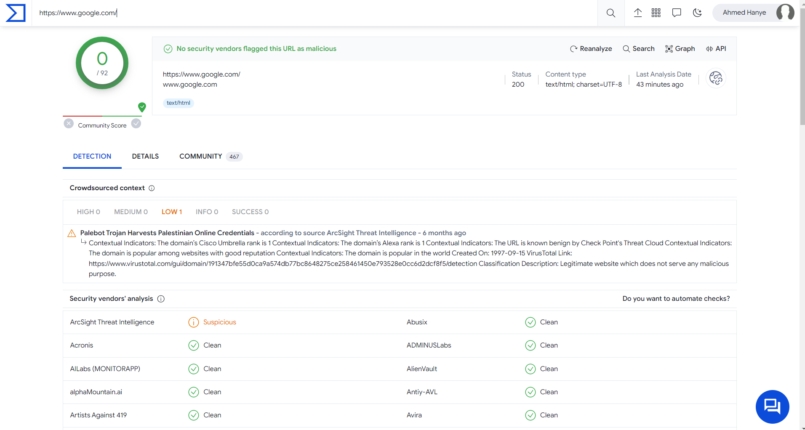
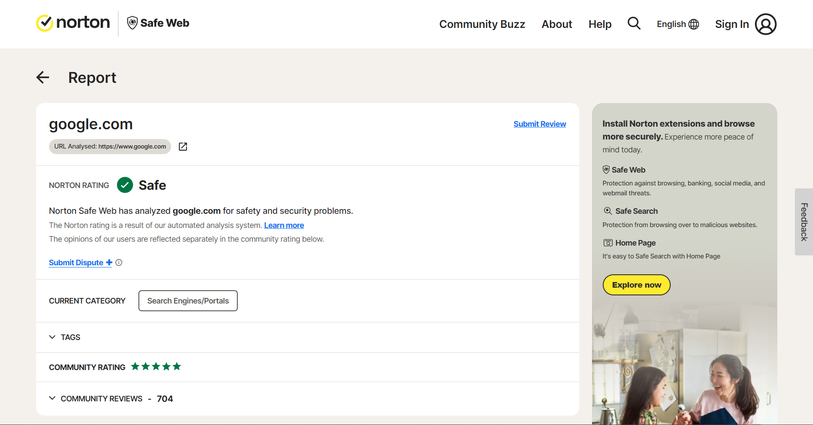
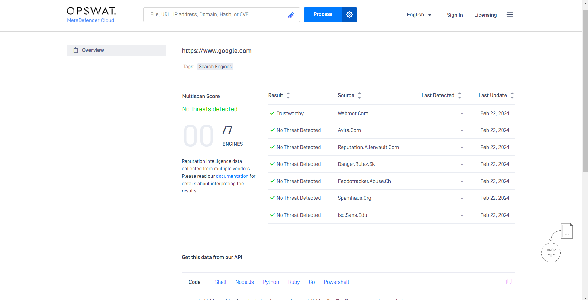

# Web Scraping with Playwright

This Python script performs web scraping using Playwright to gather information from various online security tools. It extracts data from VirusTotal, Norton SafeWeb, and MetaDefender by providing a URL to each tool's search interface.

## Prerequisites

- Python 3.x
- Playwright
- Validators

You can install the required packages using pip:

```
pip install -r requirements.txt
```

```
python3 .\Check_url.py https://www.google.com
```

## Tools

The script utilizes the following online security tools:

- VirusTotal: https://www.virustotal.com/gui/home/url

- Norton SafeWeb: https://safeweb.norton.com/

- MetaDefender: https://metadefender.opswat.com/


## Playwright

[Playwright](https://playwright.dev/python/docs/intro) is a Python library for automating browsers. It provides a high-level API for interacting with web pages using modern browser capabilities.

## Contributing

Contributions are welcome! If you encounter any issues or have suggestions for improvements, feel free to open an issue or submit a pull request.

## Creator

Ahmed Hanye
